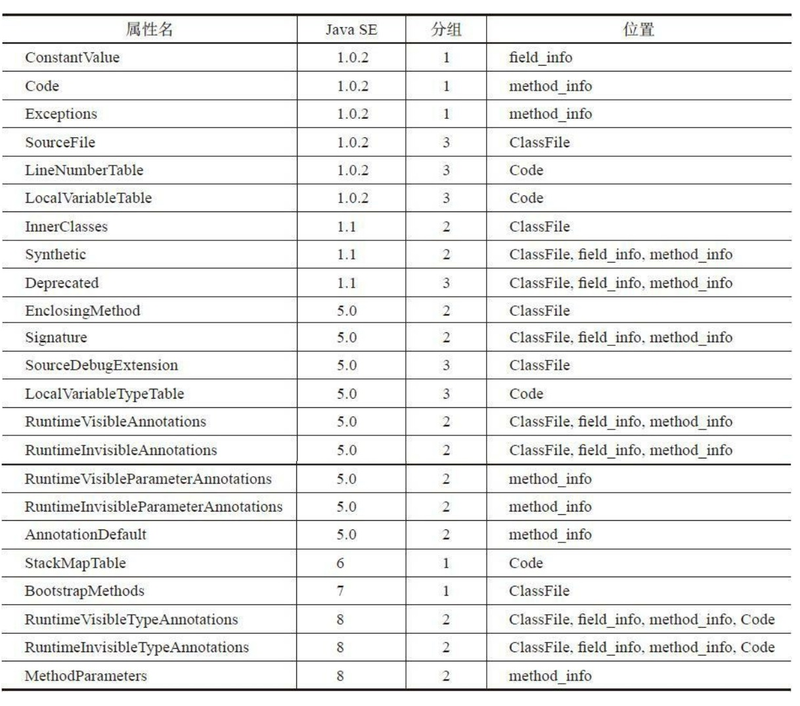
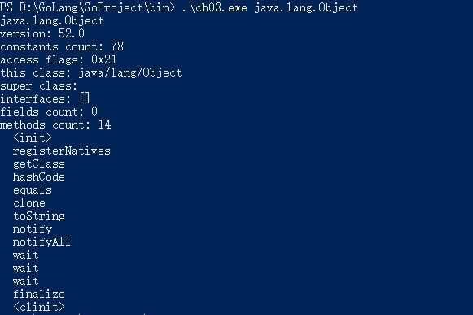

- class文件

    本章将详细讨论class文件的格式，编写代码来解析二进制数据。
    构成class文件的基本数据单位是字节，可以把整个class文件当作是一个字节流来处理。这些数据在class文件中以大端（big-endian）方式
    存储，为了描述class文件格式，虚拟机规范定义了u1，u2，u4三种类型来表示1，2，4字节的无符号整数，分别对应Go语言
    中的uint8.uiny16，uint32类型。
    
    相同类型的多条数据一般按表（table）的形式存储在class文件中。表由表头和表项（item）构成，表头是u2或u4的整数。假设表头是n，后面就会
    跟着n个表项数据。
    
    java虚拟机规范使用一种类似C的结构体语法来描述class文件的格式。整个class文件被描述为一个ClassFile结构，代码如下
```
ClassFile {
    u4 magic;
    u2 minor_version;
    u2 major_version;
    u2 constant_pool_count;
    cp_info constant_pool[constant_pool_count-1];
    u2 access_flags;
    u2 this_class;
    u2 super_class;
    u2 interfaces_count;
    u2 interfaces[interfaces_count];
    u2 fields_count;
    field_info fields[fields_count];
    u2 methods_count;
    method_info methods[methods_count];
    u2 attributes_count;
    attribute_info attributes[attributes_count];
}
```
  JDK提供了一个命令行工具javap，可以用它来反编译class文件，下面定义一个ClassFileTest类来作为模板解析，代码如下
```
    public class ClassFileTest {
        public static final boolean FLAG = true;
        public static final byte BYTE = 123;
        public static final char X = 'X';
        public static final short SHORT = 12345;
        public static final int INT = 123456789;
        public static final long LONG = 12345678901L;
        public static final float PI = 3.14f;
        public static final double E = 2.71828;
        public static void main(String[] args) throws RuntimeException {
            System.out.println("Hello, World!");
        }
}
```

- 解析class文件

    - 读取数据
     
    可以把class文件当作字节流处理，但是直接操作字节很不方便，所以先定义一个结构体来帮助读取数据。
    [class_reader.go](classfile/class_reader.go),在其中定义了ClassReader结构体和相应的数据读取方法。注：ClassReader并没有使用索引来记录
    数据位置，而是使用Go语言的reslice语法跳过了已经读取的数据
    
    - 整体结构
    
    创建[class_file.go](classfile/class_file.go)，在其中定义ClassFile结构体,MajorVersion()等其中的6个方法是Getter方法，ClassName()从
    常量池查找类名，SuperClassName()从常量池查找超类名，InterfaceNames()从常量池查找接口名。
    
    - Magic Number
    
    很多文件都会规定满足该格式的文件必须以几个固定字节开头。class文件的magic number是“0xCAFEBABE”，
    readAndCheckMagic()方法
    ```
     func (self *ClassFile) readAndCheckMagic(reader *ClassReader) {
        magic := reader.readUint32()
        if magic != 0xCAFEBABE {
            panic("java.lang.ClassFormatError: magic!")
        }
     }
    ```
    如果class文件不符合规范应该抛出异常，但因还未涉及异常，所以暂时先终止程序执行
    
   - 版本号 
   
   magic number之后是次版本号和主版本号，都是u2类型。形式类似"M.m"的形式。次版本号只在J2SE 1.2之前是45，
   从1.2开始，每次有大的Java版本发布，都会加1，下图列出了class文件版本号
   
   
   Java SE8向下兼容到45.0-52.0的class文件，如果遇到不支持的版本号就会抛出java.lang.UnsupportedClassVersionError异常。

    - 类访问标志
    
    版本号之后是常量池，暂时放到下一节单独介绍。常量池之后是类访问标志，这是一个16位的"bitmask"，指出class文件定义
    的是类还是接口，访问级别是public还是private等等。本章只是读取，第六章会详细讨论访问标志。
    
    - 类和超类索引
    
    类访问标志之后是两个u2类型的常量池索引，分别给出类名和超类名。class文件存储的类名类似完全限定名，
    但是把点换成了斜线，Java语言规范把这种名字叫做二进制名(binary names)。因为每个类都有名字，所以thisClass必须是
    有效的常量池索引。除java.lang.Object之外，其他类都有超类，所以superClass只在Object.class中是0，在其他class
    文件中必须是常量池索引。
    
    - 接口索引表
    
    类和超类索引后面是接口索引表，存放的也是常量池索引，给出的是该类实现的所有接口的名字。
    
    - 字段和方法表
    
    接口索引表之后是字段表和方法表，分别存储字段和方法信息。字段和方法的基本结构大致相同，差别仅在于属性表。
    Java虚拟机规范给出的字段结构定义
```
    field_info {
        u2             access_flags;
        u2             name_index;
        u2             descriptor_index;
        u2             attributes_count;
        attribute_info attributes[attributes_count];
    }
```
    
  和类一样，字段和方法也有自己的访问标志。访问标志之后是一个常量池索引，给出字段名或方法名，然后又是一个
  常量池索引，给出字段或方法的描述符，最后是属性表。[member_info.go](classfile/member_info.go)定义了MemberInfo
  结构体
  
- 解析常量池

    常量池占据了class文件很大的一部分数据，里面存放着各种各样的常量信息，包括数字和字符串常量、类
    和接口名、字段和方法名等等。
    
    - ConstantPool结构体
    
    [constant_pool.go](classfile/constant_pool.go),常量池实际上是一个表，但有三点需要注意。
    
    第一，表头给出的常量池大小比实际大1。假如表头给出的值是n，那么常量池的实际大小是n-1。
    
    第二，有效的常量池索引是1~n-1。0是无效索引，表示不指向任何常量。
    
    第三，Constant_long_info和Constant_double_info各占两个位置。也就是说，如果常量池中存在这两种常量，实际的常量比n-1还要少，而且1~n-1的某些数也会无效索引。
    
    - ConstanInfo接口
    
    由于常量池中存放的信息各不相同，所以每种常量的格式也不同。常量数据的第一字节是tag，用来区分常量类型。
    Java虚拟机规范一共定义了14种常量。[constant_info.go](classfile/constant_info.go)
    
- 解析属性表
    
    - AttributeInfo接口
      
    和常量池类似，各种属性表达的信息也各不相同，因此无法使用统一的结构体来定义。而且因为Java虚拟机规范定义的属性一共只有14种，
    而属性是可以扩展的，因此使用属性名来区别不同的属性，属性数据放在属性名之后的u1表中，这样java虚拟机可以跳过自己无法识别的属性。
    ```
        attribute_info {
            u2 attribute_name_index;
            u4 attribute_length;
            u1 info[attribute_length];
        }
    ```
    java虚拟机预定了23种属性，按照用途，23种预定义属性可以分为三组。
    第一组属性是实现Java虚拟机所必须的，共有5种。第二组属性是Java类库所必须的，共有12种。第三组属性主要一共给工具使用，共有6种。
    JDK1.0只有6种预定义属性，JDK1.1增加了3种，J2SE 5.0增加了9种，主要用于支持泛型和注解。Java SE6增加了StackMapTable属性，
    用于优化字节码验证。Java SE7增加了BootstrapMethods属性，用于支持新增的invokeddynamic指令，Java SE8又增加了三种属性,
    只介绍其中八种属性

    
    
    - Deprecated和Synthetic属性
            
    Deprecated和Synthetic是最简单的两种属性，仅起标记作用，不包含任何数据。Deprecated用于指出类、接口、字段或方法已经
    不建议使用，编译器可以根据Deprecated属性输出警告信息。
    Synthetic属性用来标记源文件中不存在、由编译器生成的类成员，引入Synthetic属性是为了支持嵌套类和嵌套接口。
    
    - SourceFile属性
    
    SourceFile是可选定长属性，只会出现在ClassFile结构中，用于指出源文件名
    
    - ConstantValue属性
    
    定长属性，只会出现在filed_info结构中，用于表示常量表达式的值。
    
    - Code属性
    
    变长属性，只存在与method_info结构中。COde属性中存放字节码等方法相关信息。
    
    - Exceptions属性
    
    变长属性，记录方法抛出的异常表
    
    - LineNumberTable和LocalVariableTable属性
    
    LineNumberTable属性表存放方法的行号信息，LocalVariableTable属性表中存放方法的局部变量信息。这两种属性和前面的SourceFile都属于
    调试信息，都不是运行时所必需的。
    
- 测试本章代码

    

    
    
    
    