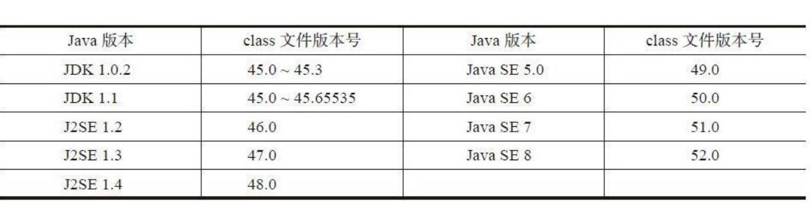

- class文件

    本章将详细讨论class文件的格式，编写代码来解析二进制数据。
    构成class文件的基本数据单位是字节，可以把整个class文件当作是一个字节流来处理。这些数据在class文件中以大端（big-endian）方式
    存储，为了描述class文件格式，虚拟机规范定义了u1，u2，u4三种类型来表示1，2，4字节的无符号整数，分别对应Go语言
    中的uint8.uiny16，uint32类型。
    
    相同类型的多条数据一般按表（table）的形式存储在class文件中。表由表头和表项（item）构成，表头是u2或u4的整数。假设表头是n，后面就会
    跟着n个表项数据。
    
    java虚拟机规范使用一种类似C的结构体语法来描述class文件的格式。整个class文件被描述为一个ClassFile结构，代码如下
```
ClassFile {
    u4 magic;
    u2 minor_version;
    u2 major_version;
    u2 constant_pool_count;
    cp_info constant_pool[constant_pool_count-1];
    u2 access_flags;
    u2 this_class;
    u2 super_class;
    u2 interfaces_count;
    u2 interfaces[interfaces_count];
    u2 fields_count;
    field_info fields[fields_count];
    u2 methods_count;
    method_info methods[methods_count];
    u2 attributes_count;
    attribute_info attributes[attributes_count];
}
```
  JDK提供了一个命令行工具javap，可以用它来反编译class文件，下面定义一个ClassFileTest类来作为模板解析，代码如下
```
    public class ClassFileTest {
        public static final boolean FLAG = true;
        public static final byte BYTE = 123;
        public static final char X = 'X';
        public static final short SHORT = 12345;
        public static final int INT = 123456789;
        public static final long LONG = 12345678901L;
        public static final float PI = 3.14f;
        public static final double E = 2.71828;
        public static void main(String[] args) throws RuntimeException {
            System.out.println("Hello, World!");
        }
}
```

- 解析class文件

    - 读取数据
     
    可以把class文件当作字节流处理，但是直接操作字节很不方便，所以先定义一个结构体来帮助读取数据。
    [class_reader.go](classfile/class_reader.go),在其中定义了ClassReader结构体和相应的数据读取方法。注：ClassReader并没有使用索引来记录
    数据位置，而是使用Go语言的reslice语法跳过了已经读取的数据
    
    - 整体结构
    
    创建[class_file.go](classfile/class_file.go)，在其中定义ClassFile结构体,MajorVersion()等其中的6个方法是Getter方法，ClassName()从
    常量池查找类名，SuperClassName()从常量池查找超类名，InterfaceNames()从常量池查找接口名。
    
    - Magic Number
    
    很多文件都会规定满足该格式的文件必须以几个固定字节开头。class文件的magic number是“0xCAFEBABE”，
    readAndCheckMagic()方法
    ```
     func (self *ClassFile) readAndCheckMagic(reader *ClassReader) {
        magic := reader.readUint32()
        if magic != 0xCAFEBABE {
            panic("java.lang.ClassFormatError: magic!")
        }
     }
    ```
    如果class文件不符合规范应该抛出异常，但因还未涉及异常，所以暂时先终止程序执行
    
   - 版本号 
   
   magic number之后是次版本号和主版本号，都是u2类型。形式类似"M.m"的形式。次版本号只在J2SE 1.2之前是45，
   从1.2开始，每次有大的Java版本发布，都会加1，下图列出了class文件版本号
   
   
   Java SE8向下兼容到45.0-52.0的class文件，如果遇到不支持的版本号就会抛出java.lang.UnsupportedClassVersionError异常。

    

    
    
    
    