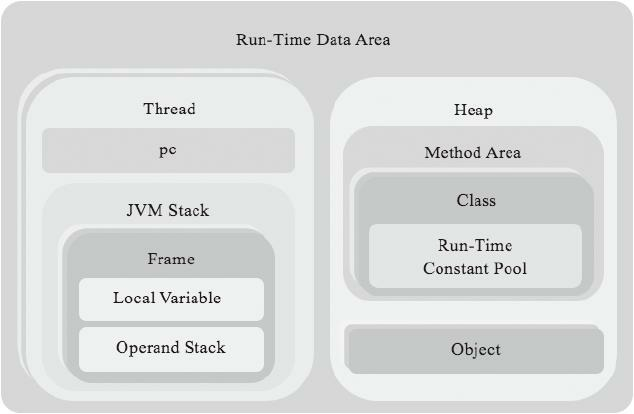

#### 运行时数据区

运行程序时，Java虚拟机需要使用内存来存放各种各样的数据。Java虚拟机规范把这些内存区域叫做运行时数据区。运行时数据区分为两类，
一类是多个线程共享，一类是线程私有。

- 多线程共享

    主要存放类数据和类的实例（对象），对象存在于堆（Heap）中，类的数据存放在方法区（Method Area）中，堆会有GC来定期清理，
    类数据包括了一些字段和方法信息、字节的字节码，运行时常量池等等
     
- 线程私有

    用于辅助执行Java字节码，每个线程都有自己的PC寄存器（Program Counter）和Java虚拟机栈（JVM Stack），
    JVM虚拟机栈又有栈帧（Stack Frame）构成，帧会保存方法的执行状态，包括局部变量表（Local Variable）和操作数
    栈（Operand Stack）等
    
    
    
    -----
    虚拟机可以操作两种类型的数据，基本类型（Primmitive type）和引用类型
    （reference type），引用类型分为类类型，接口类型和数组类型（接口类型的引用指向的是实现了该接口的类或者数组实例）
    
     
     
 - 线程
 
    在[thread.go](rtda/thread.go)中定义了Thread结构体，目前只有pc和stack两个字段。其中stack字段是Stack结构体指针。虚拟机规范
    对栈的约束相当宽松，可以是连续也可以不连续，可以固定大小也可以是动态扩展的空间。如果有大小限制且超过了限制就会抛出
    StackOverflowError，如果是可以扩展但是内存被耗尽会抛出OutOfMemoryError异常。
    
-  Java虚拟机栈

    Java虚拟机规范对栈的约束也很宽松，我们用链表（linked list）来实现。这样栈就可以按需使用内存空间，而且弹出
    的帧也可以被Go的垃圾收集器回收。在[jvm_stack.go](rtda/jvm_stack.go)中定义了Stack结构体。_top字段保存了栈顶
    指针
    
- 帧

    在[frame.go](rtda/frame.go)中定义了Frame结构体，lower用来实现链表数据结构，localVars字段保存局部变量表指针，
    operandStack保存操作数栈指针
    
- 局部变量表

    局部变量表是按照索引访问的，所以很自然用数组实现，在[slot.go](rtda/slot.go)中定义了Slot结构体，其中num
    存放整数，ref存放字段引用，用[]Slot来实现局部变量表，[local_vars.go](rtda/local_vars.go)
    
- 操作数栈
    
    类似于局部变量表，利用[]Slot，在[operand_stack.go](rtda/operand_stack.go)中定义了OperandStack结构体，操作数栈
    的大小是编译器已经确定的
    
- 实例分析
     
     ```
     public static float circumference(float r) {
        float pi = 3.14f;
        float area = 2 * pi * r;
        return area;
     }
     ```
     
     ```
     00 ldc #4
     02 fstore_1
     03 fconst_2
     04 fload_1
     05 fmul
     06 fload_0
     07 fmul
     08 fstore_2
     09 fload_2
     10 freturn
     ```
     ------
     


circumference（）方法的局部变量
表大小是3，操作数栈深度是2。假设调用方法时，传递给它的参数
是1.6f，方法开始执行前，帧的状态如图所示


第一条指令是ldc，它把3.14f推入栈顶，如图所示。


接着是fstore_1指令，它把栈顶的3.14f弹出，放到#1号局部变量中


  
fconst_2指令把2.0f推到栈顶


fload_1指令把#1号局部变量推入栈顶


fmul继续乘法计算，它把栈顶的两个浮点数弹出，相乘，然后把结果推入栈顶，


fload_0指令把#0号局部变量推入栈顶，


fmul继续乘法计算，


fstore_2指令把操作数栈顶的float值弹出，放入#2号局部变量表


fload_2指令把#2号局部变量推入操作数栈顶


最后freturn指令把操作数栈顶的float变量弹出，返回给方法调用者

---
-  测试

go install jvmgo/ch04

ch04.exe test

----

第四章介绍了运行时数据取，初步实现了Thread，Stack，Frame，OperandStack和LocalVars等线程私有的运行时数据区。 
