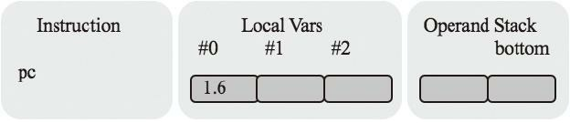
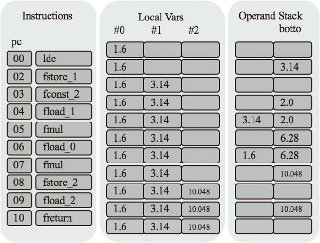

### 运行时数据区
- 多线程共享

    主要存放类数据和类的实例（对象），对象存在于堆（Heap）中，
    类的数据存放在方法区（Method Area）中，堆会有GC来定期清理，
    类数据包括了一些字段和方法信息、字节的字节码，运行时常量池等等
     
- 线程私有

    用于辅助执行Java字节码，每个线程都有自己的PC寄存器（Program Counter）和Java虚拟机栈（JVM Stack），
    JVM虚拟机栈又有栈帧（Stack Frame）构成，帧会保存方法的执行状态，包括局部变量表（Local Variable）和操作数
    栈（Operand Stack）等
    
    
    
    -----
    虚拟机可以操作两种类型的数据，基本类型（Primmitive type）和引用类型
    （reference type），引用类型分为类类型，接口类型和数组类型（接口类型的引用指向的是实现了该接口的类或者数组实例）
    
     
     
     -----
     
     ```
     public static float circumference(float r) {
        float pi = 3.14f;
        float area = 2 * pi * r;
        return area;
     }
     ```
     
     ```
     00 ldc #4
     02 fstore_1
     03 fconst_2
     04 fload_1
     05 fmul
     06 fload_0
     07 fmul
     08 fstore_2
     09 fload_2
     10 return
     ```
     ------
     


circumference（）方法的局部变量
表大小是3，操作数栈深度是2。假设调用方法时，传递给它的参数
是1.6f，方法开始执行前，帧的状态如图所示


第一条指令是ldc，它把3.14f推入栈顶，如图所示。


接着是fstore_1指令，它把栈顶的3.14f弹出，放到#1号局部变量中


  
fconst_2指令把2.0f推到栈顶


fload_1指令把#1号局部变量推入栈顶


fmul继续乘法计算，它把栈顶的两个浮点数弹出，相乘，然后把结果推入栈顶，


fload_0指令把#0号局部变量推入栈顶，


fmul继续乘法计算，


fstore_2指令把操作数栈顶的float值弹出，放入#2号局部变量表


fload_2指令把#2号局部变量推入操作数栈顶



最后freturn指令把操作数栈顶的float变量弹出，返回给方法调用者

---
-  测试

go install jvmgo/ch04

ch03.exe test
