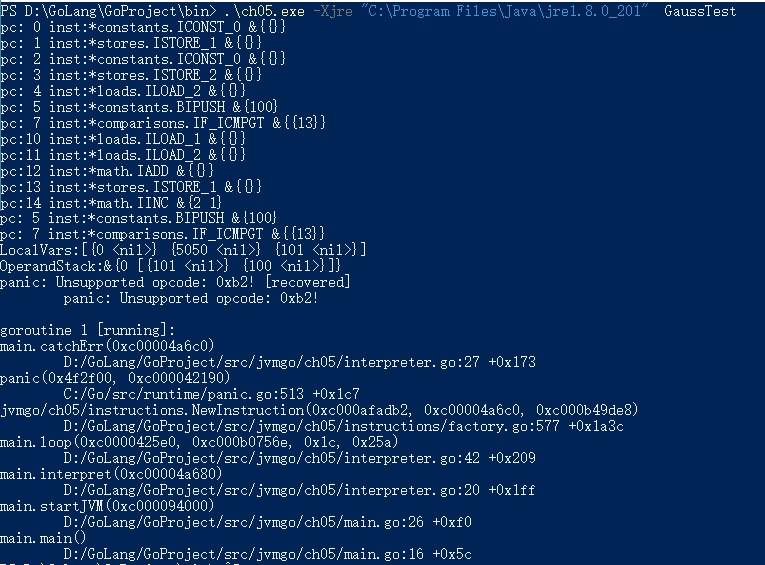

本章在前两章的基础上会是显示一个简单的解释器，并且实现大约150条指令，在之后会不断改进这个解释器，
让它可以执行更多的指令。

- 字节码和指令集

    Java虚拟机顾名思义没事一台虚拟的机器，而字节码(bytecode)就是运行在这台机器上的
    机器码。已知每个Java文件都会被便一场一个class文件，类或接口的方法信息就放在class文件的
    method_info结构中。如果方法不是抽象的也不是native方法，就会被编译器编译成字节码（即使方法是空的
    编译器也会生成一条return语句），存放在method_info的Code属性中。
    
    字节码中存放编译后的Java虚拟机指令。每条指令都以一个单字节的操作码（opcode）开头。由于只使用一字节
    表示字节码，因此Java虚拟机最后只能支持256（2^8）条指令，截止到第八版已经定义了205条指令，分别是
    0到202，254和255。这205条指令称为Java虚拟机的指令集(instruction set)。和汇编语言类似，每个
    字节码有一个助记符（mnemonic）。比如0x00助记符是nop。
    
    Java虚拟机使用的是变长指令，操作码后面可以跟零字节或多字节的操作数（operand）。如果把指令想象
    成函数的话，操作数就是它的参数。为了让编码后的字节码更加紧凑，很多操作吗本身就是隐含了
    操作数，比如把常数0推入操作数栈的指令是iconst_0。下面通过例子来观察虚拟机指令。
    
    
    getstatic指令的操作码是0xB2，助记符是getstatic，操作数0x0002，代表常量池里的第二个常量。
    第四章中我们知道操作数栈和常量池只存放了数据的值，并不记录数据类型。所以指令必须知道自己在
    操作什么类型的数据。因此iadd指令就是对iint进行加法，dstore就是把操作数栈顶的double值弹放入巨变
    变量表中；areturn从方法中返回引用值。也就是说，如果某类指令可以操作不同类型的变量，
    则助记符的第一个字母表示变量类型。其对应关系如下所示。
    
    
    
    Java虚拟机规范把205条指令按用途分成了11类，分别是：常量（constants）指令、加载（loads）指令、
    存储（stores）指令、操作数栈（stack）指令、数学（math）指令、转换（conversions）指令、比较（comparisions）指令
    、控制（control）指令、引用（refrences）指令、扩展（extended）指令、保留（reserved）指令。
    
    保留指令一共有三条，其中一条留给调试器，用于实现断点，操作码是202(0xCA),助记符是breakpoint。另外两条
    留给Java虚拟机实现内部使用，操作码分别是254和255，助记符是impdep1和impdep2.这三条指令不允许
    出现在class文件中。
    
    本章会实现11类中的9类，在本章讨论native方法时会用到保留指令impdep1指令，引用指令分布在第6，7，8，10章中。为了方便管理，
    我们将新建instructions目录并有10个子目录。
    
- 指令和指令解码

    Java虚拟机规范介绍了Java虚拟机的大致逻辑，如下
    ```
      do {
        atomically calculate pc and fetch opcode at pc;
        if (operands) fetch operands;
        execute the action for the opcode;
      } while (there is more to do);
    ```
    大致逻辑包含:计算pc，指令解码，指令执行，用go来实现代码大致如下：
    ```
      for {
        pc := calculatePC()
        opcode := bytecode[pc]
        inst := createInst(opcode)
        inst.fetchoperands(bytecode)
        inst.execute()
     }
    ```
    
    - Instruction接口
    
    [instruction.go](instructions/base/instruction.go),FetchOperands()方法从字节码中提取操作数，
    Execute()方法执行指令逻辑。有很多指令的操作数都是类似的，为了避免重复代码，按照操作数
    类型定义一些结构体，并实现了FetchOperands()方法。相当于Java中的抽象类。
    
    NoOperandsInstruction表示没有操作数的指令，所以其对应的FetchOperands()方法实现也是空的。
    
    BranchInstruction结构体表示跳转指令，Offset字段存放跳转偏移量。FetchOperands()方法从中字节码中
    读取一个uint16证书，转成int后赋给Offset字段。
                    
    存储和加载类指令需要根据索引存取局部变量表，索引由单子接操作数给出。这类指令抽象成Index8Instruction结构体，
    用Index字段表示局部变量表索引。FetchOperands()方法从字节码中读取一个int8整数，转成uint后赋给Index字段。
    
    有一些指令需要访问运行时常量池，常量池索引由两字节操作数给出。把这类指令抽象成Index16Instruction结构体，
    用Index字段表示常量池索引。Fetchoperands()方法从字节码中读取一个uint16整数，转成uint后赋给Index字段。
    
    - BytecodeReader
    
    [bytecode_reader.go](instructions/base/bytecode_reader.go)中定义了BytecodeReader结构体，code字段存放字节码，
    pc字段记录读取到了哪个字节。为了避免每次解码指令都新创建一个BytecodeReader为实例，定义一个Reset()方法。
    
    还需要定义两个方法：ReadInt32s()和SkipPadding()。这两个方法只有tableswitch和lookupswitch指令使用，介绍这两条指令
    时再给出代码。
    
    在接下来的9个小节中，将要按照分类依次实现150条指令，虽然数目众多，但是指令很多类似，比图iload、lload、fload、dload和
    aload这5条，除了操作的数据不同，代码几乎相同。
    
    
- 常量指令

    常量指令把常量推入操作数栈顶。常量可以来自三个地方：隐含在操作码里、操作数和运行时常量池。常量指令共有21条。本节实现
    其中18条，另外三条ldc系列指令用于从运行时常量池加载常量将在第6章介绍。
    
    - nop指令
    
    [nop.go](instructions/constants/nop.go) 最简单的一条指令，什么也不做
    
    - const系列指令
    
    这一系列指令把隐含在操作码中的常量值推入操作数栈顶。在instruction\constants目录下创建[const.go](instructions/constants/const.go)文件，
    在其中定义15条指令。account_null指令把null引用推入操作数栈顶
    ```
        func (self *ACONST_NULL) Execute(frame *rtda.Frame) {
            frame.OperandStack().PushRef(nil)
        }
    ```
    dconst_0指令把double型0推入操作数栈顶
    ```
        func (self *DCONST_0) Execute(frame *rtda.Frame) {
            frame.OperandStack().PushDouble(0.0)
        }
    ```
    iconst_m1指令把int型-1推入操作数栈顶
    ```
        func (self *ICONST_M1) Execute(frame *rtda.Frame) {
            frame.OperandStack().PushInt(-1)
        }
    ```
    
    - bipush和sipush指令
    
    bipush指令从操作数中获取一个byte型整数，扩展成int型，然后推入栈顶。sipush指令从操作数中获取一个short型整数扩展成int型，然后推入栈顶。
    在instructions\constants下新建[ipush.go]
    
- 加载指令
    
    加载指令从局部变量表获取变量，然后推入操作数栈顶。加载指令共33条，按照所操作的变量类型分为6类，aload系列
    操作引用类型变量、dload系列操作double类型变量、fload系列操作float变量、iload系列操作int变量、lload系列操作long变量、xaload操
    作数组。本节实现其中的25条，数组相关在第8章实现。下面以iload为例介绍加载指令
    
    在instructions/loads目录下新建[iload.go](instructions/loads/iload.go),在其中定义五条指令,iload的索引来自操作数，其余四条
    来自操作码中，代表要从局部变量表中获取第几个变量
    ```
    type ILOAD struct{ base.Index8Instruction }
    type ILOAD_0 struct{ base.NoOperandsInstruction }
    type ILOAD_1 struct{ base.NoOperandsInstruction }
    type ILOAD_2 struct{ base.NoOperandsInstruction }
    type ILOAD_3 struct{ base.NoOperandsInstruction }
    ```
    
- 存储指令
    
    存储指令是把变量从操作数栈顶弹出，放入局部变量表中，正好和加载指令相反。存储指令也分为6类，以lstore系列
    指令为例进行介绍，在instructions/stores目录下创建[lstore.go](instructions/stores/lstore.go)，在其中包含了5
    条指令，如下
    ```
    type LSTORE struct{ base.Index8Instruction }
    type LSTORE_0 struct{ base.NoOperandsInstruction }
    type LSTORE_1 struct{ base.NoOperandsInstruction }
    type LSTORE_2 struct{ base.NoOperandsInstruction }
    type LSTORE_3 struct{ base.NoOperandsInstruction }
    ```
    lstore指令的索引来自操作数，其余四条的索引隐含在操作码中
    
- 栈指令

    栈指令直接对操作数进行操作，共9条：pop和pop2指令将栈顶变量弹出，dup系列指令复制栈顶变量，swap指令
    交换栈顶的两个变量。
   
    和其他指令不同，栈指令并不关心变量类型。为了实现栈指令，需要给OperandStack结构体添加两个方法。在
    [operand_stack.go](rtda/operand_stack.go)中定义PushSlot()和PopSlot()方法，
    ```
    func (self *OperandStack) PushSlot(slot Slot) {
        self.slots[self.size] = slot
        self.size++
    }
    func (self *OperandStack) PopSlot() Slot {
        self.size--
        return self.slots[self.size]
    }
    ```
    
    - pop和pop2指令
    
      在/instructions/stack中新建[pop.go](instructions/stack/pop.go),pop只能弹出int、float等占用一个操作数栈
      的变量，double和long变量需要使用pop2指令弹出
      
   - dup指令
   
     创建[dup.go](instructions/stack/dup.go),dup指令复制栈顶的单个变量，dup2复制栈顶的两个变量
     
  - swap指令
  
   创建[swap.go](instructions/stack/swap.go),swap指令会交换栈顶的两个变量
   
- 数学指令
  
  大致对应的Java语言中的加减乘除等数学运算符，数学指令包括算术指令、位移指令和布尔运算指令等，共37条，
  将全部在本节实现。
  
  - 算术指令
  
  可以细分为加法(add)指令、减法(sub)指令、乘法(mul)指令、除法(div)指令、求余(rem)指令和取反(neg)指令六种
  以求余指令为例[rem.go](instructions/math/rem.go),先从操作数栈中弹出两个int变量，求余，然后把结果推操作数栈。
  
  - 位移指令
  
  位移指令可以分为左移和右移两种，右移又可以分为无符合（逻辑）右移和有符合（算术）右移，在instructions\math\下创建
  [sh.go](instructions/math/sh.go),在其中定义了6条位移指令
  ```
    // int左移
    type ISHL struct{ base.NoOperandsInstruction }
    // int算术右移
    type ISHR struct{ base.NoOperandsInstruction }
    // int逻辑右移
    type IUSHR struct{ base.NoOperandsInstruction }
    // long左移
    type LSHL struct{ base.NoOperandsInstruction }
    // long算术右移
    type LSHR struct{ base.NoOperandsInstruction }
    // long逻辑右移
    type LUSHR struct{ base.NoOperandsInstruction }
  ```
  
  - 布尔运算指令
  
  布尔运算指令只能用于操作int和long变量，分为按位与(and)、按位或（or）、按位异或（xor）三种。
  以按位与为例介绍布尔运算指令。在instructions/math下创建[and.go](instructions/math/and.go)
  
  - iinc指令
  
  iinc指令给局部变量表中的int变量增加常量值，局部变量索引和常量值都由指令的操作数提供。
  在instruction/math下创建[iinc.go](instructions/math/iinc.go)
  
- 类型转换指令

    类型转换指令大致对应Java语言中的基本类型强制类型转换操作。类型转换指令共有15条，将全部实现。
    引用类型的转换对应的checkcast指令将在第6章实现。
    
    按照被转换变量的类型，类型转换指令可以分为3种：i2x系列指令把int变量强制转换成其他类型；l2x系列指令
    把long变量强制转换成其他类型；f2x系列指令把float变量强制转换成其他类型；d2x系列指令把double变量强制
    转换成其他类型。以d2x系列指令为例进行讨论。
    
    在ch05/instructions/conversions下创建[d2x.go](instructions/conversions/d2x.go),在其中定了d2f、d2i、d2l指令
    ```
    type D2F struct{ base.NoOperandsInstruction }
    
    type D2I struct{ base.NoOperandsInstruction }
    
    type D2L struct{ base.NoOperandsInstruction }
    ```
    
- 比较指令

    比较指令可以分为两类，一类将比较结果i推入操作数栈顶，一类根据比较结果跳转。比较指令是编译器实现
    if-else，for，while等语句的基石，共19条，将在本节全部实现。
    
    - lcmp指令
    
    用于比较long变量。在ch05/instructions/comparisons目录下创建[lcmp.go](instructions/comparisons/lcmp.go)文件，在其中定义lcmp指令
    Execute()方法把栈顶的两个long变量弹出，进行比较，然后把比较结果（int型0、1或-1）推入栈顶
    ```
        func (self *LCMP) Execute(frame *rtda.Frame) {
            stack := frame.OperandStack()
            v2 := stack.PopLong()
            v1 := stack.PopLong()
            if v1 > v2 {
                stack.PushInt(1)
            } else if v1 == v2 {
                stack.PushInt(0)
            } else {
                stack.PushInt(-1)
            }
        }

    ```
    
    - fcmp<op>和dcmp<op>指令
    
    fcmpg和fcmpl指令用于比较float变量。在ch05\instructions\comparisons目录下创建[fcmp.go](instructions/comparisons/fcmp.go)文件,
    在其中定义fcmpg和fcmpl指令
    ```
    // Compare float
    type FCMPG struct{ base.NoOperandsInstruction }
    
    type FCMPL struct{ base.NoOperandsInstruction }
    ```
    
    在比较两个浮点数时，除了大于等于和等于之外，还存在第4种结果：无法比较。编写一个函数来统一比较float变量
    ```
    func _fcmp(frame *rtda.Frame, gFlag bool) {
    	stack := frame.OperandStack()
    	v2 := stack.PopFloat()
    	v1 := stack.PopFloat()
    	if v1 > v2 {
    		stack.PushInt(1)
    	} else if v1 == v2 {
    		stack.PushInt(0)
    	} else if v1 < v2 {
    		stack.PushInt(-1)
    	} else if gFlag {
    		stack.PushInt(1)
    	} else {
    		stack.PushInt(-1)
    	}
    }

    ```
    
    当两个float变量中至少有一个是NaN时，用fcmpg指令比较的结果是1，而用fcmpl指令比较的结果是-1。
    
    dcmpg和dcmpl指令用来比较double变量，在[dcmp.go](instructions/comparisons/dcmp.go)文件中，这两条指令和fcmpg、fcmpl指令除了比较的变量
    类型不同之外，代码基本相同。
    
    - if<cond>指令
    
    在ch05/instructions/comparisons目录下创建[ifcond.go](instructions/comparisons/ifcond.go)文件，在其中定义if<cond>指令，代码如下
    ```
        // Branch if int comparison with zero succeeds 
        // x==0
        type IFEQ struct{ base.BranchInstruction }
        // x != 0
        type IFNE struct{ base.BranchInstruction }
        // x < 0
        type IFLT struct{ base.BranchInstruction }
        // x > 0
        type IFGT struct{ base.BranchInstruction }
        // x <= 0
        type IFLE struct{ base.BranchInstruction }
        // x >= 0
        type IFGE struct{ base.BranchInstruction }
    ```
    
    - if_icmp<cond>指令
    
    在ch0\instructions\comparisons目录下创建[if_icmp.go](instructions/comparisons/if_icmp.go)
    ```
    // Branch if int comparison succeeds
    type IF_ICMPEQ struct{ base.BranchInstruction }
    type IF_ICMPNE struct{ base.BranchInstruction }
    type IF_ICMPLT struct{ base.BranchInstruction }
    type IF_ICMPLE struct{ base.BranchInstruction }
    type IF_ICMPGT struct{ base.BranchInstruction }
    type IF_ICMPGE struct{ base.BranchInstruction }
    ```
    
    - if_acmp<cond>指令
    
    在ch05\instructions\comparisons目录下创建[if_acmp.go](instructions/comparisons/if_acmp.go)，在其中
    定义两条if_acmp<cond>指令，代码如下
    ```
    // Branch if reference comparison succeeds
    type IF_ACMPEQ struct{ base.BranchInstruction }
    
    type IF_ACMPNE struct{ base.BranchInstruction }
    ```
    
- 控制指令

    控制指令共有11条,jsr和ret指令在Java6之前用于实现finally子句，Java6之后已经不再使用这两条指令，所以不讨论这两条。
    return系列指令有六条，用于从方法调用中返回，将在第7章讨论方法调用和返回时实现这六条指令。本节实现
    剩下的3条指令：goto、tableswitch和lookupswitch。
    - goto指令
    
    新建[goto.go](instructions/control/goto.go)文件，定义goto指令
    
    - tableswitch指令
    
    Java语言中的switch-case语句有两种实现方式：如果case值可以编码成索引表，则实现成tableswitch指令；否则实现成
    lookupswitch指令。下面这个方法中的switch-case可以编译成tableswitch指令
    ```
    int chooseNear(int i) {
        switch(1) {
            case 0:return 0;
            case 1:return 1;
            case 2:return 2;
            default:return -1;
        }
    }
    ```
    下面这个方法会变编译成lookupswitch指令
    ```
    int chooseFar(int i) {
            switch(1) {
                case -100:return -1;
                case 0:return 0;
                case 100:return 1;
                default:return -1;
            }
        }
    ```
    
    新建[tableswitch.go](instructions/control/tableswitch.go)文件，定义tableswitch指令
    - lookupswitch指令
    
    新建[lookupswitch.go](instructions/control/lookupswitch.go)文件，定义lookupswitch指令
    
- 扩展指令

    扩展指令共6条。本书不讨论jsr_w指令和multianewarray指令用于创建多维数组，只实现剩下的4条指令。
    
    - wide指令
    
    加载类指令、存储类指令、ret指令和iinc指令需要按索引访问局部变量表，索引以uint8的形式存在
    字节码中。对于大部分方法来说，局部变量表大小都不会超过256，所以用一字节来表示索引就够了。但如果
    有方法对于局部变量表超过这个限制，因此Java虚拟机规范定义了wide指令扩展前述指令。
    
    新建[wide.go](instructions/extended/wide.go)文件，wide指令改变其他指令的行为，modifiedInstruction字段存放被
    改变的指令。wide指令需要自己解码出modifiedInstruction。FetchOperands()方法先从字节码中读取一字节的
    操作码，然后创建子指令，因为没有实现ret指令所以暂时调用painc，加载指令和存储指令都只有一个操作数，
    需要扩展成2字节。
    
    wide只是增加索引宽度，并不改变子指令操作，所以其Execute只需调用子指令的Execute方法即可。
    
    - ifnull和ifnonnull指令
    
    创建[ifnull.go](instructions/extended/ifnull.go文件，在其中定义ifnull和ifnonnull指令
    ```
    // Branch if reference is null
    type IFNULL struct{ base.BranchInstruction }
    // Branch if reference not null
    type IFNONNULL struct{ base.BranchInstruction }
    ```
    根据引用是否是null进行跳转，ifnull和ifnonnull指令把栈顶的引用弹出。
    
    - goto_w指令
    
    创建[goto_w.go](instructions/extended/goto_w.go)文件，goto_w指令和goto的唯一区别
    就是索引从2字节变成了4字节。
- 解释器

    本节将会实现一个简单的解释器。这个解释器目前只能执行一个Java方法，但是之后会不断进行完善，
    创建[interpreter.go](interpreter.go)文件，在其中定义interpret方法，该方法的参数是MemberInfo指针，
    调用MemberInfo结构体的CodeAttribute方法可以获取它的Code属性。
    
    得到Code属性之后可以进一步获得执行方法所需的局部变量表和操作数栈空间，以及方法的字节码。interpret
    方法的其余代码先创建一个Thread实例，然后创建一个帧并把它推入Java虚拟机栈顶，最后执行方法。
    
- 测试代码
    根据这段java代码通过javac生成class文件交由虚拟机处理
    ```
    public class GaussTest {
    	public static void main(String[] args) {
    		int sum = 0;
    		for(int i = 0 ; i <= 100; i++) {
    			sum += i;
    		}
    		System.out.println(sum);
    	}	
    }
    ```
    
    观察局部变量表最后输出了5050
    
  
  
  
   