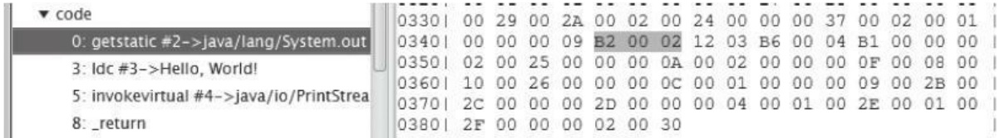
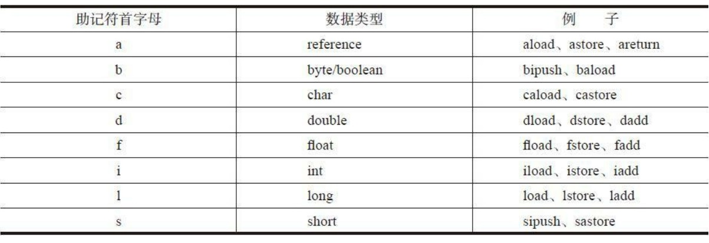

本章在前两章的基础上会是显示一个简单的解释器，并且实现大约150条指令，在之后会不断改进这个解释器，
让它可以执行更多的指令。

- 字节码和指令集

    Java虚拟机顾名思义没事一台虚拟的机器，而字节码(bytecode)就是运行在这台机器上的
    机器码。已知每个Java文件都会被便一场一个class文件，类或接口的方法信息就放在class文件的
    method_info结构中。如果方法不是抽象的也不是native方法，就会被编译器编译成字节码（即使方法是空的
    编译器也会生成一条return语句），存放在method_info的Code属性中。
    
    字节码中存放编译后的Java虚拟机指令。每条指令都以一个单字节的操作码（opcode）开头。由于只使用一字节
    表示字节码，因此Java虚拟机最后只能支持256（2^8）条指令，截止到第八版已经定义了205条指令，分别是
    0到202，254和255。这205条指令称为Java虚拟机的指令集(instruction set)。和汇编语言类似，每个
    字节码有一个助记符（mnemonic）。比如0x00助记符是nop。
    
    Java虚拟机使用的是变长指令，操作码后面可以跟零字节或多字节的操作数（operand）。如果把指令想象
    成函数的话，操作数就是它的参数。为了让编码后的字节码更加紧凑，很多操作吗本身就是隐含了
    操作数，比如把常数0推入操作数栈的指令是iconst_0。下面通过例子来观察虚拟机指令。
    
    
    getstatic指令的操作码是0xB2，助记符是getstatic，操作数0x0002，代表常量池里的第二个常量。
    第四章中我们知道操作数栈和常量池只存放了数据的值，并不记录数据类型。所以指令必须知道自己在
    操作什么类型的数据。因此iadd指令就是对iint进行加法，dstore就是把操作数栈顶的double值弹放入巨变
    变量表中；areturn从方法中返回引用值。也就是说，如果某类指令可以操作不同类型的变量，
    则助记符的第一个字母表示变量类型。其对应关系如下所示。
    
    
    
    Java虚拟机规范把205条指令按用途分成了11类，分别是：常量（constants）指令、加载（loads）指令、
    存储（stores）指令、操作数栈（stack）指令、数学（math）指令、转换（conversions）指令、比较（comparisions）指令
    、控制（control）指令、引用（refrences）指令、扩展（extended）指令、保留（reserved）指令。
    
    保留指令一共有三条，其中一条留给调试器，用于实现断点，操作码是202(0xCA),助记符是breakpoint。另外两条
    留给Java虚拟机实现内部使用，操作码分别是254和255，助记符是impdep1和impdep2.这三条指令不允许
    出现在class文件中。
    
    本章会实现11类中的9类，在本章讨论native方法时会用到保留指令impdep1指令，引用指令分布在第6，7，8，10章中。为了方便管理，
    我们将新建instructions目录并有10个子目录
    